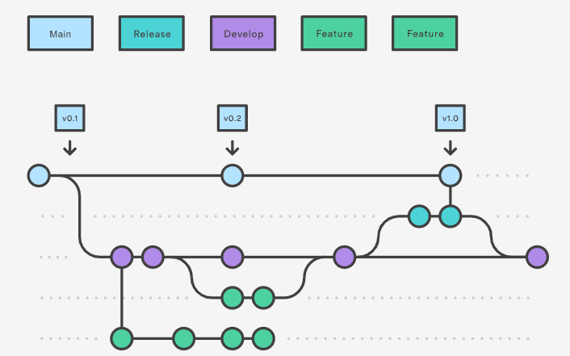

# Bitz-Tech-Talks 

## Índice

- [1. Introdução](#introdução)
- [2. Como é feito?](#como-é-feito)
- [3.Branch](#branchs)
- [4.Como clonar o projeto?](#como-realizar-um-fork-no-github)

#### Introdução
##### GITFLOW

O Gitflow é um *fluxo de trabalho* legado do Git que no começo era uma estratégia inovadora e revolucionária para gerenciar ramificações do Git.

---

##### Como é feito?
Sob este modelo, os desenvolvedores criam uma ramificação de recurso e retardam o merge com a ramificação de tronco principal até que o recurso esteja completo. Essas ramificações de recursos de longa duração exigem mais colaboração para fazer o merge e têm um risco maior de se desviarem da ramificação do tronco.

Exemplificando, o Gitflow é apenas uma ideia abstrata do fluxo de trabalho Git, ou seja, ele dita que tipos de ramificações configurar e como fazer o merge.

Neste repositório temos o exemplo simples e claro de como seguir este fluxo, fique a vontade para testar em sua máquina.

---
#### Branchs
 

 
#### Ramificações de desenvolvimento e principal

A main/master irá contér todo código já testado, versionado que será entregue ao cliente e a develop/dev é onde todo fluxo de trabalho irá ocorrer antes de fazer o release versionado que será feito merge na master.

A develop deve sempre conter o código mais atual, onde as branchs de features serão ramificadas tendo ela como base.

**feature:** para novas implementações

**release:** para finalizar o release e tags

**hotfix:** para resolver problema crítico em produção que não pode esperar novo release

---

#### Como realizar um Fork no GitHub? 
**1°** Entre no repositório do projeto que você quer Forka.

**2°** No canto superior direito terá um botão‘FORK’,clique nelepara realizar o Fork do projeto.

**3°** Após realizar o evento de clique, você será encaminhado
para uma tela de criação do FORK.
Onde é possível você alterar o nome do projeto.

**4°** Depois de criar o FORK, o projeto estará disponível em seu
repositório

**5°** Agora basta clonar ele em sua máquina e começar a Codar

---
